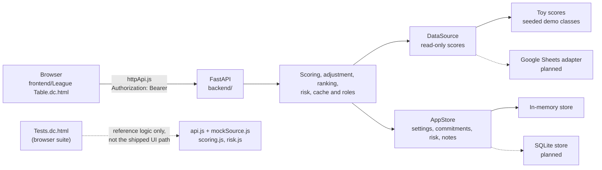

<div align="center">

# League Table

**A live scoreboard for a university class.** Rank students each week on the criteria the instructor chooses, adjust fairly for the hours they spend on work and care, and show every student exactly how their score was worked out.

[](https://www.python.org)
[](https://fastapi.tiangolo.com)
[](https://docs.astral.sh/uv/)
[](https://pytest.org)
[](#status)
[](LICENSE)


<sub>Seeded demo data: PHYS 204 · Mechanics and DATA 118 · Intro to Data.</sub>

</div>

## Features

- **Podium and ranked list** with score bars, movement since last week and the points to the place above. Switch between a single week, a cumulative average and a rolling average, pick criteria, and re-weight them.
- **Fair to outside commitments:** reported weekly hours of work, child care and elder care are combined into weighted hours and multiply the score by a capped factor (by default one point per weighted hour, at most ×1.25). Scores stop at 100.
- **Explainable scores:** open a breakdown to see each criterion's contribution, the raw score, weighted hours, the factor, the adjusted score and a note when it was capped at 100. Everyone can read the formula and current numbers in the explainer.
- **Private:** classmates see only the final adjusted score and rank, never another student's hours, factor or raw score. Students can only open their own breakdown, commitments and standing.
- **Fair to missing data:** a criterion with no entry is left out and the remaining weights are rescaled, so absence of data is never scored as zero.
- **Ties:** students level on adjusted score are ordered by raw score, then the configured tie-breakers; any still level share a rank (1, 1, 3).
- **Privacy toggle:** show full names, initials or nicknames in one click.
- **Risk digest:** the instructor sees newly, still and cleared flags across every class they teach, each traced to five evidence-backed signals (downward trend, missed engagement, low projected grade, heavy commitments, missing data). Step through any week with the same control used on the league table; each week is always compared against the one before it.
- **Outreach notes:** log private, timestamped notes on a student's risk record. Notes never travel to a student.
- **Student standing:** each student sees only their own level, the signals that are on, and where to get help — no ranks, no classmates, no notes.
- **Server-side rules:** scoring, the adjustment, ranking, risk and roles all run on the backend.

## Quick start

You need [uv](https://docs.astral.sh/uv/) and `make`.

```sh
make install   # install backend dependencies
make run       # serve the app at http://localhost:8000
make test      # run the backend tests
```

Then open <http://localhost:8000>. The interactive API docs are at <http://localhost:8000/docs>.

`make run` serves both the API and the frontend from one origin. The page talks to the FastAPI service next to it over HTTP with Bearer auth (see [Auth](#auth)) for everything — scoring, ranking, risk and roles all run on the server, seeded with two demo classes of 24 students each.

## How it works



- The contract is [`openapi.yaml`](openapi.yaml). `frontend/services/httpApi.js` is the live client the shipped page uses; `frontend/services/api.js` + `mockSource.js` are a client-side reference implementation of the same contract, exercised only by the browser test suite (`tests.js`/`Tests.dc.html`), not by the running app. A contract test checks the running app against `openapi.yaml`.
- Scores come through a read-only `DataSource`. Today that is two seeded toy classes of 24 students, 16 weeks and 5 criteria each, including a tie, a missing entry, a perfect week, a zero week and a late joiner. Entries run through all 16 weeks, so week 16 is the landing week.
- Everything the service owns lives in the read-write `AppStore`: league settings, baselines, weekly updates, risk settings and snapshots, and instructor notes.
- Reads are cached for 60 seconds. If the source fails, the last good snapshot is served and marked stale. Refresh is rate-limited to once every 10 seconds.
- Problems in the data, such as an unknown student ID, are listed instead of breaking the table.

## API

All endpoints take a Bearer token (see [Auth](#auth)). The full contract is in [`openapi.yaml`](openapi.yaml).

| Endpoint | Who | Purpose |
| --- | --- | --- |
| `GET /classes` | instructor | Classes the instructor teaches |
| `GET /classes/{id}/bootstrap` | signed in (students: own class) | Weeks, criteria, weights, settings, accounts, source and issues in one call |
| `GET /classes/{id}/ranking?week=&criteria=&window=` | signed in (students: own class; rows scoped) | Ranked adjusted scores for a week, cumulative or rolling window |
| `GET /classes/{id}/students/{sid}/explanation` | instructor, or the student themselves | The full breakdown, including hours, factor and cap |
| `GET /classes/{id}/explainer` | signed in | The formula and current parameters, with no personal data |
| `GET /me/commitments?classId=&studentId=` | instructor, or the student themselves | Baseline, weekly updates, and hours, factor and source by week |
| `GET /instructor/digest?week=` | instructor | New/still/cleared flags across every class, for a chosen week (default: each class's latest complete week) compared against the week before it |
| `GET /classes/{id}/students/{sid}/risk` | instructor (with notes), or the student themselves (notes hidden) | Level, five signals with evidence, metrics, thresholds, history |
| `POST /classes/{id}/students/{sid}/notes` | instructor | Log private outreach (body trimmed, empty rejected) |
| `GET`/`PUT /classes/{id}/risk-settings` | instructor | Per-class risk thresholds and active signals |
| `GET /me/standing?classId=&studentId=` | the student themselves | Own level, active signals and help — nothing else |
| `PUT /classes/{id}/settings` | instructor | Criterion weights and adjustment parameters (weights normalised to 100) |
| `GET /classes/{id}/status`, `POST /classes/{id}/refresh` | signed in | Data freshness and cache refresh (rate-limited, stale fallback) |

## Auth

Every endpoint needs `Authorization: Bearer <token>`; the server derives the role (instructor/student), student ID and class membership from it and enforces ownership with 403s. There is no login endpoint: tokens are issued out of band (university sign-in later).

The demo accepts opaque tokens:

- `i1` — the instructor
- `s01` — a student in `c1` (likewise any `sNN` → `c1`, `tNN` → `c2`)
- `student:<sid>:<cid>` / `instructor:<iid>` forms (e.g. `student:s01:c1`)

For example:

```sh
curl -H "Authorization: Bearer i1" "http://localhost:8000/classes/c1/ranking?week=w5"
```

## Project layout

| Path | What is in it |
| --- | --- |
| [`frontend/`](frontend) | The page and its services layer: `httpApi.js` (the live client, used by the page) plus `api.js`/`mockSource.js`/`scoring.js`/`risk.js` (a reference implementation exercised only by the browser test suite `tests.js`) |
| [`backend/`](backend) | The FastAPI service and its pytest suite. See [`backend/README.md`](backend/README.md) |
| [`openapi.yaml`](openapi.yaml) | The API contract |
| [`_docs/spec.md`](_docs/spec.md) | The product spec: goals, scoring rules, data model and phasing |

## Testing

- **Backend:** `make test` runs the pytest suite, covering every endpoint, the scoring and adjustment rules, privacy scoping, the risk engine and digest, notes, the seeded edge cases and the OpenAPI contract.
- **Lint:** `make lint` runs ruff and mypy over the backend (both are dev dependencies).
- **Frontend:** the scoring, risk and mock-client tests run in the browser at <http://localhost:8000/Tests.dc.html> while the app is running (no headless runner yet, so there is no `make` target for them). These exercise the reference `scoring.js`/`risk.js`/`api.js` logic, not `httpApi.js`; the shipped page's real HTTP integration is covered by the backend's own endpoint tests plus manual/browser verification.

## Status

This is an early version, built on demo data.

- [x] FastAPI backend implementing the whole OpenAPI contract, on toy scores and an in-memory store
- [x] Frontend wired to the real backend over HTTP (`httpApi.js`) instead of the in-browser mock
- [x] Table, podium, week, cumulative and rolling windows, weights, breakdowns
- [x] Commitments-based adjustment with a capped factor, the 100 ceiling and raw-score tie-breaks
- [x] Risk digest, risk records with evidence and history, instructor notes, student standing
- [x] Roles and privacy scoping enforced on the server
- [ ] Student self-service for commitments (baseline submission, weekly updates)
- [ ] Animated reveal, replay, streaks and badges
- [ ] Google Sheets adapter, data check against a real sheet, and a SQLite `AppStore`
- [ ] University sign-in (JWT issuance), privacy review, retention and backups before real students use it

See the phasing in [`_docs/spec.md`](_docs/spec.md) for the plan.

## License

[MIT](LICENSE)
