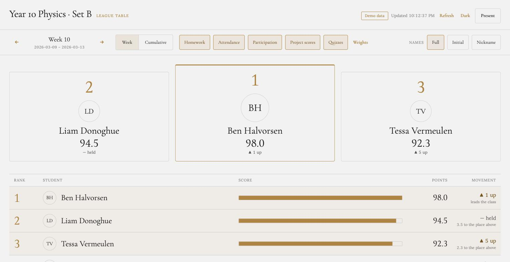
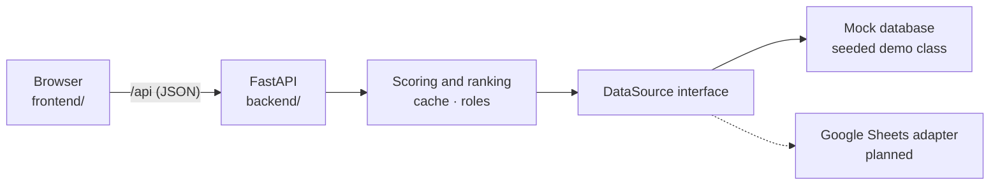

<div align="center">

# League Table

**A live scoreboard for a high-school class.** Rank students each week on the criteria the teacher chooses, and show every student exactly how their score was worked out.

[](https://www.python.org)
[](https://fastapi.tiangolo.com)
[](https://docs.astral.sh/uv/)
[](https://pytest.org)
[](#status)
[](LICENSE)



<sub>Seeded demo data: Year 10 Physics, week 10.</sub>

</div>

## Features

- **Podium and ranked list** with score bars, movement since last week (▲ up, ▼ down, held) and the points to the place above.
- **Teacher controls:** step through weeks, switch between a single week and a cumulative total, pick criteria, and re-weight them with sliders. **Present** mode hides the controls for projection.
- **Explainable scores:** click any row to see each criterion's earned and possible points, its weight and its contribution. The parts add up exactly to the score.
- **Fair to missing data:** a criterion with no entry is left out and the remaining weights are rescaled, so absence of data is never scored as zero.
- **Ties share a rank** (1, 1, 3), ordered by attendance, then homework.
- **Privacy toggle:** show full names, initials or nicknames in one click.
- **Server-side rules:** scoring, ranking and roles all run on the backend, so a student can read the table but only open their own breakdown.

## Quick start

You need [uv](https://docs.astral.sh/uv/) and `make`.

```sh
make install   # install backend dependencies
make run       # serve the app at http://localhost:8000
make test      # run the backend tests
```

Then open <http://localhost:8000>. The interactive API docs are at <http://localhost:8000/api/docs>.

`make run` serves both the API and the frontend from one origin, so the session cookie works. There is no sign-in screen yet: with demo data the page signs in as the demo teacher automatically.

## How it works



- The browser only renders. `frontend/services/httpApi.js` is the one place that talks to the backend, on the same origin under `/api`.
- The backend implements [`openapi.yaml`](openapi.yaml), and a contract test checks the running app against it.
- Data comes through a read-only `DataSource` interface. Today that is an in-memory mock with a reproducible class of 35 students, 10 weeks and 5 criteria, including a tie, a missing entry, a perfect week, a zero week and a late joiner.
- Reads are cached for 60 seconds. If the source fails, the last good snapshot is served and marked stale. A teacher can refresh at most once every 10 seconds.
- Problems in the data, such as an unknown student ID, are listed instead of breaking the table.

## API

| Endpoint | Who | Purpose |
| --- | --- | --- |
| `POST /api/auth/login`, `/auth/google`, `/auth/logout`; `GET /auth/me` | anyone / signed in | Sign in and session |
| `GET /api/classes/{id}` | signed in | Class, weeks, criteria, weights and status in one call |
| `GET /api/classes/{id}/ranking` | signed in | The ranked table for a week or cumulative window |
| `GET /api/classes/{id}/students/{sid}/explanation` | teacher, or the student themselves | Per-criterion breakdown |
| `GET`/`PUT /api/classes/{id}/weights` | read: signed in, write: teacher | Criterion weights |
| `GET /api/classes/{id}/status`, `POST .../refresh` | read: signed in, refresh: teacher | Data freshness and cache refresh |
| `GET /api/demo/accounts` | anyone (demo data only) | Demo accounts and their dummy credentials |

The full contract is in [`openapi.yaml`](openapi.yaml).

## Demo accounts

`GET /api/demo/accounts` lists them. For example, sign in as `teacher@demo.test` with `demo-teacher-1`, or as the student `amara@demo.test` with `demo-student-1`. Google sign-in is mocked: send the token `demo-google:<email>`.

## Project layout

| Path | What is in it |
| --- | --- |
| [`frontend/`](frontend) | The page and its services layer (`httpApi.js` for the real backend; `api.js` and `mockSource.js` are the in-browser mock used by the frontend tests) |
| [`backend/`](backend) | The FastAPI service, tests and mock database. See [`backend/README.md`](backend/README.md) |
| [`openapi.yaml`](openapi.yaml) | The API contract |
| [`_docs/spec.md`](_docs/spec.md) | The product spec: goals, scoring rules, data model and phasing |

## Testing

- **Backend:** `make test` runs the pytest suite, covering every endpoint, the seeded edge cases and the OpenAPI contract.
- **Frontend:** the scoring and client tests run in the browser at <http://localhost:8000/Tests.dc.html> while the app is running.

## Status

This is an early version, built on demo data.

- [x] FastAPI backend implementing the whole OpenAPI contract, on a mock database
- [x] Teacher view: table, podium, week and cumulative windows, weights, breakdowns, Present mode
- [x] Roles enforced on the server
- [ ] Student view and a sign-in screen (the API already supports them)
- [ ] Google Sheets adapter, so teachers enter scores in a sheet
- [ ] A real database for weights and accounts
- [ ] Clever roster sync and sign-in

See the phasing in [`_docs/spec.md`](_docs/spec.md) for the plan.

## License

[MIT](LICENSE)
