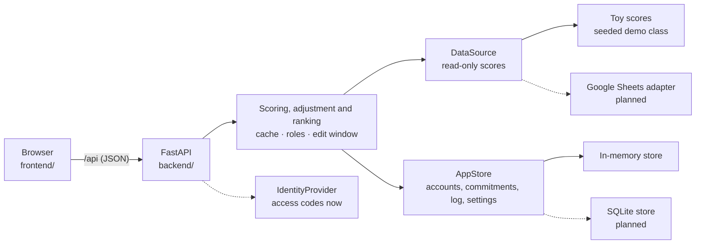

<div align="center">

# League Table

**A live scoreboard for a university class.** Rank students each week on the criteria the instructor chooses, adjust fairly for the hours they spend on work and care, and show every student exactly how their score was worked out.

[](https://www.python.org)
[](https://fastapi.tiangolo.com)
[](https://docs.astral.sh/uv/)
[](https://pytest.org)
[](#status)
[](LICENSE)


<sub>Seeded demo data: Introductory Physics, week 16.</sub>

</div>

## Features

- **Podium and ranked list** with score bars, movement since last week (▲ up, ▼ down, held) and the points to the place above. On a phone the podium folds away and the list is the main view.
- **Instructor controls:** step through weeks, switch between a single week, a cumulative average and a rolling average, pick criteria, and re-weight them with sliders. **Present** mode hides the controls and every personal panel for projection.
- **Fair to outside commitments:** a student can report weekly hours of work, child care and elder care. The score is multiplied by a capped factor (by default one point per weighted hour, at most ×1.25) and stops at 100.
- **Approved, logged and reversible:** the instructor approves each semester baseline from a chosen week and can reverse any weekly update. Every change is in a change log, and the rate, cap and hour weights can be tuned.
- **Explainable scores:** click a row (students: your own) to see each criterion's contribution, the raw score, your weighted hours, the factor, the adjusted score and a note when it was capped at 100. Everyone can read the formula and current numbers under **How scores work**.
- **Private:** classmates see only the final adjusted score and rank, never another student's hours, factor or raw score. Student pages show your own row pinned and highlighted.
- **Fair to missing data:** a criterion with no entry is left out and the remaining weights are rescaled, so absence of data is never scored as zero.
- **Ties:** students level on adjusted score are ordered by raw score, then attendance, then homework; any still level share a rank (1, 1, 3).
- **Privacy toggle:** show full names, initials or nicknames in one click.
- **Server-side rules:** scoring, the adjustment, the edit window (current and previous week only), approvals and roles all run on the backend.

## Quick start

You need [uv](https://docs.astral.sh/uv/) and `make`.

```sh
make install   # install backend dependencies
make run       # serve the app at http://localhost:8000
make test      # run the backend tests
```

Then open <http://localhost:8000>. The interactive API docs are at <http://localhost:8000/api/docs>.

`make run` serves both the API and the frontend from one origin, so the session cookie works. The page opens on a sign-in screen; with demo data it lists the demo instructor and five students, each in a different commitments state, so you can fill in their code with one click. The instructor gets the controls, approvals and settings. A student gets the table, their own breakdown and the My commitments screen.

## How it works



- The browser only renders. `frontend/services/httpApi.js` is the one place that talks to the backend, on the same origin under `/api`.
- The backend implements [`openapi.yaml`](openapi.yaml), and a contract test checks the running app against it.
- Scores come through a read-only `DataSource`. Today that is an in-memory toy class of 24 students, 16 weeks and 5 criteria, including a tie, a missing entry, a perfect week, a zero week and a late joiner. The term is anchored to today, so the edit window works on a real clock.
- Everything people enter goes to the read-write `AppStore`: accounts, baselines, weekly updates, settings and the change log. Each change and its log entry are saved together.
- Reads are cached for 60 seconds. If the source fails, the last good snapshot is served and marked stale. The instructor can refresh at most once every 10 seconds.
- Problems in the data, such as an unknown student ID, are listed instead of breaking the table.

## API

| Endpoint | Who | Purpose |
| --- | --- | --- |
| `POST /api/auth/login`, `/auth/logout`; `GET /auth/me` | anyone / signed in | Sign in with an access code or the instructor passcode; session |
| `GET /api/classes/{id}` | signed in | Class, weeks, criteria, weights and status in one call |
| `GET /api/classes/{id}/ranking` | signed in | Ranked adjusted scores for a week, cumulative or rolling window |
| `GET /api/classes/{id}/students/{sid}/explanation` | instructor, or the student themselves | The full breakdown, including hours, factor and cap |
| `GET /api/classes/{id}/explainer` | signed in | The formula and current parameters, with no personal data |
| `GET`/`PUT /api/me/commitments…` | student | Own baseline, weekly updates, reset and a live preview |
| `GET /api/classes/{id}/approvals`, `POST …/approvals/{aid}` | instructor | Approve from a week, or reject |
| `POST …/students/{sid}/weeks/{n}/reverse`, `GET …/change-log`, `GET …/commitments` | instructor | Reverse an update, review the log and every student's status |
| `GET`/`PUT /api/classes/{id}/settings` | instructor | Criterion weights and the adjustment's type weights, rate and cap |
| `GET /api/classes/{id}/status`, `POST …/refresh` | read: signed in, refresh: instructor | Data freshness and cache refresh |
| `GET /api/demo/accounts` | anyone (demo data only) | Demo accounts and their access codes |

The full contract is in [`openapi.yaml`](openapi.yaml).

## Demo accounts

`GET /api/demo/accounts` lists them. The instructor signs in with the passcode `demo-instructor`; students use `demo-amara` (approved baseline and a weekly update), `demo-ben` (factor at the cap), `demo-cleo` (baseline pending), `demo-dara` (baseline rejected) and `demo-rosa` (nothing entered). Every student in the class has a code of the form `demo-<first name>`. These are public on purpose and work only with demo data. Outside demo data the passcode must come from the `INSTRUCTOR_PASSCODE` environment variable.

## Project layout

| Path | What is in it |
| --- | --- |
| [`frontend/`](frontend) | The page and its services layer (`httpApi.js` for the real backend; `api.js` and `mockSource.js` are the in-browser mock used by the frontend tests) |
| [`backend/`](backend) | The FastAPI service, tests and mock database. See [`backend/README.md`](backend/README.md) |
| [`openapi.yaml`](openapi.yaml) | The API contract |
| [`_docs/spec.md`](_docs/spec.md) | The product spec: goals, scoring rules, data model and phasing |

## Testing

- **Backend:** `make test` runs the pytest suite, covering every endpoint, the adjustment rules, the edit window, approvals, privacy, the seeded edge cases, the `AppStore` contract and the OpenAPI contract.
- **Frontend:** the scoring and client tests run in the browser at <http://localhost:8000/Tests.dc.html> while the app is running.

## Status

This is an early version, built on demo data.

- [x] FastAPI backend implementing the whole OpenAPI contract, on toy scores and an in-memory store
- [x] Instructor view: table, podium, week, cumulative and rolling windows, weights, breakdowns, Present mode
- [x] Commitments-based adjustment with a capped factor, the 100 ceiling and raw-score tie-breaks
- [x] Student screens: sign-in, pinned own row, My commitments with a live preview, How scores work
- [x] Instructor screens: approvals with an effective week, reversal, change log and adjustment settings
- [x] Roles, the edit window and approvals enforced on the server
- [ ] Generating and revoking student access codes
- [ ] Animated reveal, replay, streaks and badges, head-to-head comparison
- [ ] Google Sheets adapter, data check against a real sheet, and a SQLite `AppStore`
- [ ] University sign-in, privacy review, retention and backups before real students use it

See the phasing in [`_docs/spec.md`](_docs/spec.md) for the plan.

## License

[MIT](LICENSE)
