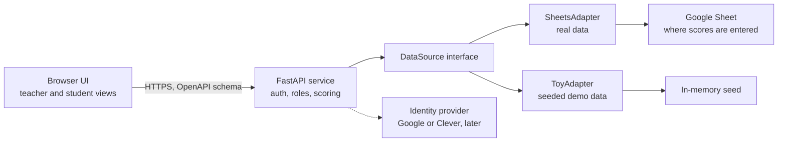

# Classroom League Table: Spec Sheet

## Overview and goals

The league table is a display for a single high-school class that shows which students are leading each week, ranked on criteria the teacher chooses: homework, attendance, participation, project scores and more. The teacher projects it in class and students open the same table on their own devices, so it must be readable from the back of the room, simple to run mid-lesson, and able to explain every rank.

Four goals shape every decision below:

- **Engaging and competitive:** the ranking should feel like a live scoreboard, with motion, movement indicators, a clear top three and the gap to the next place, not a spreadsheet on a screen.
- **Easy to use:** the teacher can change the week or the criterion in one click, with no setup during class.
- **Transparent:** every student can see exactly how their rank is calculated, criterion by criterion.
- **Data-source independent:** the FastAPI backend reads from a Google Sheet today or from a built-in toy dataset for demos, development and testing, chosen by configuration alone.

Proposed success measures (targets to confirm):

- Switching week or criterion takes one interaction and updates the table in under 500 ms.
- The table renders in under 1 second for a class of 35 students over 10 weeks.
- A student can open their own score breakdown in two taps, and its parts add up exactly to the score shown.
- Swapping the data source requires a config change and no edits to UI code.

## Users and key scenarios

The teacher controls the classroom display, and students use the same table on their own devices to see where they stand and how it is calculated.

| Role | What they need |
| --- | --- |
| Teacher | Pick a week and criteria, reveal the ranking, adjust weights, and control what students see |
| Student (high school) | See the full ranking, find their own row instantly, and understand exactly how their score is calculated and what would move them up |
| Admin / developer | Point the FastAPI service at a different data source and run it with demo data |

Scenarios the design must handle well:

1. **Monday reveal:** the teacher opens last week's ranking and plays a countdown from fifth place to first.
2. **Criterion switch:** the teacher asks "who had the best attendance?" and flips the table to that single criterion.
3. **Mid-term check:** the teacher scrubs back through weeks to show how the top ranks changed over the term.
4. **Student check:** a student opens the table on a phone, finds their own rank, taps to see the breakdown and sees how many points separate them from the next place.
5. **Demo or training:** someone runs the app with toy data and no network, without risk to real student records.

## Ranking criteria and scoring

Each student's rank comes from a weighted sum of criteria the teacher can turn on, off and re-weight; every criterion is first converted to a 0–100 scale so different units are comparable.

| Criterion | Example measure | Example default weight |
| --- | --- | --- |
| Homework | % of assignments submitted on time | 25 |
| Attendance | % of sessions attended | 20 |
| Participation | Teacher-awarded points per lesson (0–5) as % of maximum | 20 |
| Project scores | Mark as % of maximum | 25 |
| Quizzes | Mark as % of maximum | 10 |

The teacher can add custom criteria (for example, reading log or kindness points). Weights always total 100.

```latex
score_i = \sum_{c} w_c \cdot n_{ic}, \qquad n_{ic} = 100 \cdot \frac{earned_{ic}}{possible_{ic}}
```

Rules to build in:

- **Missing data:** a criterion with no entry for a student that week is excluded and the remaining weights are rescaled, so absence of data is not scored as zero. The UI marks these cells.
- **Ties:** tied students share a rank (1, 1, 3). An optional tie-breaker order, such as attendance then homework, can be set per class and is stated on screen.
- **Time windows:** the table can show a single week, a cumulative total, or a rolling average of the last N weeks.
- **Rank movement:** each row shows the change in rank against the previous week.
- **Direction:** every criterion is "higher is better" in v1.
- **Explainable scores:** for any row the app can show the formula with real numbers: each criterion's earned and possible values, its weight, the points it contributed, and the points needed to reach the next rank. The breakdown comes from the same calculation as the rank, so the parts always add up to the total.

## Core features

Version 1 covers the ranked table, the controls that drive it and the data layer behind it; extras that raise engagement follow once the basics are solid.

**Must have**

- Ranked table for the class, a chosen week and set of criteria, with score, rank and rank movement
- Highlighted top three (podium) above the full list
- Score breakdown: any row opens to show how that rank is calculated
- Student view: signed-in students see the full ranking with their own row highlighted, on phone or laptop
- Criterion picker with per-criterion weights and a single-criterion view (teacher)
- Week selector plus a cumulative view
- Present mode that hides all controls for projection
- Swappable data source (the Google Sheet, or the toy dataset) chosen by configuration
- Read-only access to scores, which the teacher enters in a Google Sheet
- Data check: mistakes in the sheet, such as an unknown student ID or a non-numeric score, are listed for the teacher instead of breaking the table
- Clear loading, empty and error states, including a "last updated" time

**Should have**

- "Gap to next rank" callouts, such as the points needed to overtake the student above
- Animated reveal that counts down from a chosen rank to first place
- Week-by-week replay where rows glide to their new positions
- Streaks and badges, such as "biggest climber" or "three weeks at the top"
- Head-to-head comparison of two students across criteria
- Display options: full name, first name and initial, or nickname
- Top N display, or a "most improved" board beside the main ranking
- Weekly trend line per student
- Saved views (for example, "Attendance this term")

**Later**

- Sign-in and roster sync through Clever (see Data layer)
- Themes such as sports league or esports
- Export of a week's table as an image or PDF
- Parent view
- Team or table-group leagues alongside individual ranking

## Visual and interaction design

The display should read like a live scoreboard for a competitive high-school class: a podium at the top, a ranked list of bars below, and motion that explains change rather than decorating it. The tone is league football or esports, not primary-school stickers.

**Layout**

- **Podium:** the top three shown larger, with avatar, name and score, first place centred.
- **Ranked list:** one row per student with rank number, name, a horizontal bar proportional to score, the score and a movement arrow (up, down or unchanged, with the number of places).
- **Control bar:** week scrubber, criterion chips, view toggle (week, cumulative, rolling) and a Present button. It collapses in Present mode.

**Motion**

- When the week or criterion changes, rows glide to their new positions and bars grow or shrink; scores count up.
- The reveal animation builds from a chosen rank to first place, one row at a time.
- Motion respects the operating system's reduced-motion setting, and sound is off by default.

**Readability from the back of the room**

- At 1920×1080, rank numbers at least 48 px, names at least 32 px, and row height at least 64 px.
- Colour is never the only signal: movement uses arrows and text as well as green and red.
- A high-contrast palette and a light and dark theme, both readable on a washed-out projector.

**Ease of use**

- Keyboard shortcuts for the teacher: left and right arrows change week, number keys pick a criterion, P toggles Present mode.
- Every control is at least 44 px and works by touch on an interactive whiteboard.
- Opening the app lands on the most recent completed week with the last-used criteria, so no setup is needed to start.
- A privacy toggle instantly switches names to initials or nicknames before the screen is shared.

**Competitive feel**

- Every row shows the gap to the place above and the place below.
- Streaks, big climbs and a new leader trigger a short banner.
- The reveal countdown and replay are built for a class watching together.
- Ties are shown side by side, and the tie-breaker is stated on screen.

**Student view**

- The signed-in student's row is pinned and highlighted, even when it is far down the list.
- Tapping a row opens the score breakdown: criterion, earned of possible, weight, points contributed, and the gap to the next rank.
- On a phone the ranked list is the main view and the podium collapses.
- Students see the same numbers as the teacher; there is no separate student score.

## Data model

The service does not store scores itself: raw entries are read from the Google Sheet and rankings are computed on the fly, so changing a weight or tie-breaker re-ranks every past week.

| Entity | Key fields | Where it lives |
| --- | --- | --- |
| Class | id, external\_id, name, term\_id | Google Sheet |
| Student | id, external\_id, class\_id, display\_name, nickname, avatar\_url, active | Google Sheet |
| Criterion | id, class\_id, key, label, unit, sort\_order | Google Sheet |
| Week | id, term\_id, week\_number, start\_date, end\_date | Google Sheet |
| Entry | id, student\_id, criterion\_id, week\_id, earned, possible, recorded\_at | Google Sheet, read-only |
| Account | id, role (teacher or student), student\_id, external\_id | App settings |
| Weights and saved views | class\_id, criterion\_id, weight, view definition | App settings |
| Ranking row | student\_id, week\_id, score, rank, rank\_delta, per-criterion breakdown | Derived by the scoring service |

Notes:

- An entry holds `earned` and `possible` rather than a percentage, so "4 of 5 homework tasks" and "82 of 100 on a project" both fit the same shape.
- Students carry an `active` flag so a student who joins or leaves mid-term does not distort earlier weeks.
- Weights and saved views are the app's own settings, kept in a small store owned by the FastAPI service and separate from the read-only score data.
- `external_id` holds the ID from an outside system, such as a Clever ID, so rosters and sign-in can be matched later without changing the model.

## Data layer: open API and swappable database

The browser talks only to a FastAPI service, which is built from scratch for this project. The service enforces who can see what, runs the scoring, and reads entries through one `DataSource` interface; each backend is an adapter chosen by configuration: a Google Sheets adapter for real data and a toy adapter for demos and tests.



Scoring lives in the service, not the browser, so a student's device only receives what that student is allowed to see. The scoring code works only with the normalised types from the data model, so no adapter detail leaks into ranking or UI code.

**DataSource interface**

| Method | Returns |
| --- | --- |
| `listClasses()` | Classes the teacher can see |
| `listStudents(classId)` | Students in the class |
| `listCriteria(classId)` | Criteria the source provides |
| `listWeeks(termId)` | Weeks in the term |
| `getEntries({ classId, weekId?, criterionIds? })` | Entries, filtered |

The interface is read-only because scores are entered elsewhere.

**FastAPI service**

We assume a REST API with JSON responses, and FastAPI provides exactly that. It publishes its own OpenAPI schema, so the front end can generate a typed client and the interactive API docs stay in step with the code. Proposed endpoints:

| Endpoint | Who can call it | Returns |
| --- | --- | --- |
| `GET /classes/{id}/ranking?week=&criteria=&window=` | Teacher, student | Ranked rows: rank, name as displayed, score, rank change |
| `GET /classes/{id}/students/{sid}/explanation?week=` | Teacher (any student), student (own only) | Per-criterion breakdown and points to the next rank |
| `GET /classes/{id}/weeks` and `/criteria` | Teacher, student | Weeks and criteria for the controls |
| `PUT /classes/{id}/weights` | Teacher | Saves criterion weights for the class |
| `/auth/*` | Teacher, student | Sign-in and session (method to be decided) |

**Service requirements**

- The Google service account key lives only in the service's environment and never reaches the browser.
- Each request to the source times out after 5 seconds and retries up to 3 times with backoff, following Google's exponential backoff guidance for HTTP 429 responses.
- Source responses are cached for 60 seconds and refreshed in the background, so switching weeks feels instant.
- If the source is unreachable, the service returns the last cached snapshot and the UI shows a "last updated" time instead of a blank screen.
- Every response is checked against the caller's role before it is sent, so a student cannot request another student's breakdown.

**Google Sheets adapter**

The teacher enters scores in a Google Sheet that follows a fixed template, and the adapter only reads it; the sheet stays the one place scores are edited. Proposed template:

| Tab | Layout | Purpose |
| --- | --- | --- |
| Students | student\_id, display\_name, nickname, email, active | Roster; the email is used for sign-in if Google sign-in is chosen |
| Weeks | week\_number, start\_date, end\_date | Calendar |
| Criteria | key, label, tab\_name, default\_weight | Which criteria exist and which tab holds each one |
| One tab per criterion, such as Homework | Row 1: student\_id, name, then one column per week. Row 2: points possible each week. Rows below: points earned per student | Scores; a blank cell means no entry, not zero |

Adapter rules:

- **One read per refresh:** the adapter fetches every tab in a single batch request. Google counts a batch as one request against a quota of 300 reads per minute per project and 60 per user, so a 60-second cache means at most one read a minute ([Google Sheets usage limits](https://developers.google.com/workspace/sheets/api/limits)). Use is free within quota, and Google says charges for exceeding it are planned for later in 2026, so the cache also guards against surprise costs.
- **Access through a service account:** a non-human Google account with a JSON key that can open no spreadsheet until the sheet is shared with its email address ([gspread authentication guide](https://docs.gspread.org/en/latest/oauth2.html)). Share the sheet with it as a viewer, and otherwise only with the teacher. An API key is not an option because it works only for publicly readable sheets, which is wrong for student data.
- **Data check:** the adapter validates every read and lists problems for the teacher, such as an unknown student ID, a non-numeric cell or points earned above points possible, instead of failing the whole table.
- **Refresh button:** the teacher can pull the latest sheet immediately, limited to one refresh every 10 seconds.

**Toy database**

- A seeded generator produces a reproducible class of 24 students, 10 weeks and 5 criteria, so demos, screenshots and tests always match.
- The seed deliberately includes edge cases: ties, missing entries, a perfect week, a zero week and a student who joins mid-term.
- It also provides demo accounts (one teacher, several students) so sign-in and role rules can be tested without real people.
- When it is active, the UI shows a "Demo data" badge so nobody mistakes it for real results.

**Switching sources**

- One setting, for example `DATA_SOURCE=sheets | toy`, selects the adapter; per-adapter settings (URL, credentials) sit beside it.
- Every adapter must pass the same contract test suite, which is what makes swapping safe.
- Real student data is never copied into the toy dataset.
- Adding a second real adapter later, such as a database, means writing one class and registering it, with no change to the UI or scoring.

**Clever integration (later)**

Clever can supply rosters and student sign-in, and possibly attendance, but a district has to opt in and its documentation does not describe homework, participation or project scores. Details below were checked against Clever's developer docs on 20 Sep 2026 and may change.

- Supported integrations are Secure Sync (district-managed rostering), SSO with rostering, LMS Connect (gradebook sync and LTI sign-in) and AnySchool rostering; the older Library route, which let a single teacher connect a class, is no longer offered ([What is Clever?](https://dev.clever.com/docs/what-is-clever)).
- Secure Sync reads students, teachers, sections, schools and enrollments from the district's student information system ([Secure Sync quickstart](https://dev.clever.com/docs/secure-sync-rostering)).
- Attendance comes from a separate Attendance API, included with a Clever Complete subscription and granted by request only. Districts must send attendance to Clever as CSV files over SFTP, and Clever keeps records for 6 months after the attendance date ([Attendance Data overview](https://dev.clever.com/docs/attendance-data-how-does-it-work)).
- Going live needs a district that uses Clever and authorises the app, plus Clever's certification steps, so this suits a school-wide rollout more than a first single-classroom version.
- Homework, participation and project scores still come from the Google Sheet.

To keep the door open, sign-in and roster sit behind small interfaces (`IdentityProvider`, `RosterSource`), and classes, students and accounts carry an `external_id`. Clever can then replace the version 1 sign-in without touching scoring.

## Non-functional requirements

Because the table shows children's names and results on a shared screen, privacy and accessibility matter as much as looks.

- **Privacy:** collect only the fields in the data model. Students are minors, so school policy and data-protection law apply to what other students can see; the school's data-protection lead should review the design. This spec is not legal advice. Store nothing about students in the browser beyond the short-lived cache, and give the teacher one-click control over how names appear.
- **Sign-in and roles:** two roles, teacher and student, enforced by the FastAPI service rather than the browser. Students can open only their own breakdown (assumption to confirm). The version 1 sign-in method is to be decided; Clever sign-in comes later.
- **Competitive by design, with switches:** the teacher wants a highly competitive feel, so the full ranking, gap-to-next-rank and streaks are on by default. Top-N display, nickname mode and a "most improved" board remain available, because public rankings can discourage students near the bottom.
- **Accessibility:** target WCAG 2.2 AA, with 4.5:1 minimum text contrast, full keyboard operation, real table semantics for screen readers, and no information carried by colour alone.
- **Performance:** first render in under 1 second and interactions in under 500 ms for 35 students over 10 weeks; animations at 60 frames per second on typical school laptops and phones.
- **Compatibility:** current Chrome, Edge, Safari and Firefox; layouts for 1920×1080 and 1280×720 projection, plus phones and tablets.
- **Reliability:** if the source fails, show the last good snapshot and say when it was taken.
- **Tech assumptions:** a FastAPI (Python) backend; the front-end framework is left open, and the front end generates a typed client from the service's OpenAPI schema.

## Phasing and acceptance criteria

Building on the toy database first lets design and scoring be finished and tested before any real API or database is involved.

| Phase | Scope | Done when |
| --- | --- | --- |
| 1. Prototype | FastAPI service built from scratch with the toy adapter, ranking endpoint, static ranked table, week and criterion switching | A teacher can browse all 10 seeded weeks and 5 criteria, and the API docs page lists every endpoint |
| 2. Scoring and breakdown | Weights, ties, rank movement, podium, animations, Present mode, per-student score breakdown | Rankings and breakdowns match hand-calculated results for the seeded edge cases, and each breakdown adds up to the score shown |
| 3. Google Sheet | Sheet template, Google Sheets adapter, data check, caching, error states | Editing the sheet updates the table within about a minute with no UI changes, and the table survives Google being unreachable |
| 4. Student access | Accounts and roles, student view on phones, server-enforced visibility | A student sees the full ranking and their own breakdown, and cannot fetch another student's breakdown |
| 5. Clever (later) | Clever sign-in and roster sync, attendance if approved | Students sign in with Clever and rosters update without manual entry |

Acceptance checklist for version 1:

- [ ] Week or criterion changes in one interaction and updates in under 500 ms
- [ ] Top three are visually distinct and readable from the back of the room
- [ ] Rank movement is correct against the previous week, including ties
- [ ] A student opens their own breakdown in two taps, and its parts add up exactly to their score
- [ ] A student cannot retrieve another student's breakdown through the API
- [ ] A mistake in the sheet appears in the data check and does not break the table
- [ ] Switching `DATA_SOURCE` needs no code changes and passes the contract suite
- [ ] Demo data is always labelled as such
- [ ] Names can be switched to initials or nicknames in one click
- [ ] Passes the WCAG 2.2 AA checks in the accessibility requirement

## Open questions

Eight questions remain, and the first three affect the build most.

1. **Who creates and maintains the sheet?** Is the proposed template (Students, Weeks, Criteria and one tab per criterion) acceptable to whoever will type the scores?
2. **How do students sign in for version 1?** Proposed: Google sign-in matched to the email column, if students have school Google accounts; otherwise teacher-created accounts.
3. **Where will the FastAPI service be hosted?** It will hold the sheet's service account key and student data, so this affects the privacy review.
4. **Does the school use Clever,** and would the district authorise a new app and its certification? This is now optional, since attendance can live in the sheet.
5. **What can students see about each other?** Proposed: everyone sees rank, name and total, while only the teacher and the student themselves see a breakdown. Confirm this suits a class of minors under school policy.
6. **Where should weights and saved views live?** Proposed: in-app sliders saved in a small store owned by the FastAPI service, or a Settings tab the teacher edits in the sheet, which keeps the app read-only.
7. **Calendar:** when does a week start, and how are holidays and short weeks handled?
8. **Languages:** which languages does the interface need to support?

## Sources

Details checked on 20 Sep 2026.

- [What is Clever?](https://dev.clever.com/docs/what-is-clever), Clever developer docs
- [Attendance Data overview](https://dev.clever.com/docs/attendance-data-how-does-it-work), Clever developer docs
- [Secure Sync quickstart](https://dev.clever.com/docs/secure-sync-rostering), Clever developer docs
- [Google Sheets usage limits](https://developers.google.com/workspace/sheets/api/limits), Google for Developers
- [Authentication](https://docs.gspread.org/en/latest/oauth2.html), gspread documentation
