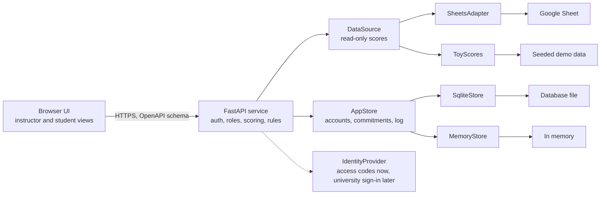

# Classroom League Table: Spec Sheet

## Overview and goals

The league table is a display for a single university class that shows which students are leading each week of a 16-week semester. Students are ranked on criteria the instructor chooses (homework, attendance, participation, project scores and more), and each student's score is adjusted for the time they spend on work, child care and elder care outside university. The instructor projects the table in class and students open the same table on their own devices, so it must be readable from the back of the room, simple to run mid-lesson, and able to explain every rank.

Six goals shape every decision below:

- **Engaging and competitive:** the ranking should feel like a live scoreboard, with motion, movement indicators, a clear top three and the gap to the next place, not a spreadsheet on a screen.
- **Easy to use:** the instructor can change the week or the criterion in one click, and a student can update their commitments in under a minute.
- **Fair to students with heavy outside commitments:** a student's raw score is multiplied by a capped factor based on the hours they report, so a strong result achieved alongside a job or caring duties is recognised.
- **Transparent:** every student can see exactly how their rank is calculated, including their own adjustment, criterion by criterion.
- **Private:** commitments are personal, so only the student and the instructor can see them; classmates see final scores only.
- **Data-source independent:** the FastAPI backend reads scores from a Google Sheet today or from a built-in toy dataset for demos, development and testing, chosen by configuration alone.

Proposed success measures (targets to confirm):

- Switching week or criterion takes one interaction and updates the table in under 500 ms.
- The table renders in under 1 second for a class of 35 students over 16 weeks.
- A student can set a semester baseline and update this week's hours in under a minute.
- A student can open their own score breakdown in two taps, and the breakdown shows exactly how the adjusted score was reached, including when it is capped at 100.
- Swapping the data source requires a config change and no edits to UI code.

## Users and key scenarios

The instructor runs the classroom display and approves commitments; students use the same table on their own devices, enter their outside commitments and see how their score is calculated.

| Role | What they need |
| --- | --- |
| Instructor | Pick a week and criteria, reveal the ranking, tune the adjustment, approve commitments and review the change log |
| Student (university) | See the full ranking, find their own row, enter and update time commitments, and understand exactly how their score and adjustment are calculated |
| Admin / developer | Point the FastAPI service at a different data source and store, and run it with demo data |

Scenarios the design must handle well:

1. **Monday reveal:** the instructor opens last week's ranking and plays a countdown from fifth place to first.
2. **Criterion switch:** the instructor asks "who had the best attendance?" and flips the table to that single criterion.
3. **Mid-term check:** the instructor scrubs back through weeks to show how the top ranks changed over the semester.
4. **Setting up:** in week 1 a student enters a semester baseline of weekly hours for work, child care and elder care, and the instructor approves it.
5. **Weekly update:** a student's shifts change, so they edit this week's hours (or correct last week's) and see their own adjustment update immediately.
6. **Student check:** a student opens the table on a phone, finds their rank, and taps to see their raw score, factor, adjusted score and the gap to the next place.
7. **Approval:** the instructor opens the approval queue, reviews hours by type, and approves a baseline from a chosen week.
8. **Demo or training:** someone runs the app with toy data and no network, without risk to real student records.

## Ranking criteria and scoring

A student's ranking score is a weighted sum of criteria, multiplied by an adjustment factor that comes from the time commitments they report, with the result capped at 100. Each criterion is first converted to a 0–100 scale so different units are comparable.

| Criterion | Example measure | Example default weight |
| --- | --- | --- |
| Homework | % of assignments submitted on time | 25 |
| Attendance | % of sessions attended | 20 |
| Participation | Instructor-awarded points per session (0–5) as % of maximum | 20 |
| Project scores | Mark as % of maximum | 25 |
| Quizzes | Mark as % of maximum | 10 |

The instructor can add custom criteria (for example, reading log). Weights always total 100.

**Step 1: raw score for week w**

```latex
raw_{iw} = \sum_{c} w_c \cdot n_{icw}, \qquad n_{icw} = 100 \cdot \frac{earned_{icw}}{possible_{icw}}
```

**Step 2: adjustment factor**

Each week a student has weekly hours for work, child care and elder care. These are combined into weighted commitment hours, converted into a factor, and the factor is capped.

```latex
H_{iw} = \sum_{k} a_k \, h_{ikw}, \qquad f_{iw} = \min\bigl(1 + r \cdot H_{iw},\; f_{max}\bigr)
```

**Step 3: adjusted score**

```latex
adjusted_{iw} = \min\bigl(100,\; raw_{iw} \cdot f_{iw}\bigr)
```

| Parameter | Meaning | Starting value (placeholder) |
| --- | --- | --- |
| h | Hours per week the student reports for a commitment type in week w | Entered by the student |
| a | How much an hour of each type counts (work, child care, elder care) | 1.0 for each |
| r | Factor added per weighted hour | 0.01, one percentage point per hour |
| f\_max | Cap on the factor | 1.25 |

The instructor can tune a, r and f\_max. A change re-ranks every affected week, and the current values appear in a general explainer that all students can read, without anyone's hours.

| Weighted hours | Factor |
| --- | --- |
| 0 | ×1.00 |
| 10 | ×1.10 |
| 20 | ×1.20 |
| 25 or more | ×1.25 (cap) |

Worked example: a raw score of 80 with 12 hours of work, 6 hours of child care and no elder care gives 18 weighted hours, a factor of 1.18 and an adjusted score of 94.4. A raw score of 92 at ×1.20 would come to 110.4, so it is shown as 100.

Rules to build in:

- **Optional and neutral by default:** a student who enters nothing, or whose baseline is not yet approved, has a factor of 1.00.
- **Capped factor:** no combination of hours can push the factor above the cap.
- **Scores stop at 100:** the adjusted score is clipped at 100, so a raw 92 at ×1.20 (110.4) shows as 100. The breakdown says when a score was capped, and bars use a fixed 0–100 scale.
- **Missing data:** a criterion with no entry for a student that week is excluded and the remaining weights are rescaled, so absence of data is not scored as zero. The UI marks these cells.
- **Time windows:** the table can show a single week, a cumulative total, or a rolling average of the last N weeks. Cumulative and rolling views average the weekly adjusted scores, so each week's factor and cap apply to that week only, and an average never exceeds 100.
- **Ties and movement:** students tied on adjusted score (compared at one-decimal precision), including several at 100, share a rank (1, 1, 3) and are ordered for display by the higher raw score, then the configured tie-breakers (by default attendance, then homework), then name. Rank movement compares adjusted ranks week to week.
- **Effective week:** an approved baseline counts from the week the instructor chooses when approving, by default the current week, so earlier weeks keep a factor of 1.00 unless the instructor picks an earlier start.
- **Direction:** every criterion is "higher is better" in v1.
- **Explainable scores:** a student's own breakdown, and the instructor's view of any student, shows each criterion's earned and possible values and weight, then the raw score, weighted hours by type, the factor, the adjusted score, a note if it was capped at 100, and the points needed to reach the next rank. The breakdown comes from the same calculation as the rank, so the parts always add up.

## Time commitments

Students enter the hours they spend each week on work, child care and elder care, once for the whole semester and then week by week wherever things change.

| Commitment | What the student enters |
| --- | --- |
| Work | Hours per week |
| Child care | Hours per week |
| Elder care | Hours per week |

Hours are entered in half-hour steps. Placeholder limits: 0–80 for each type and at most 120 in total, with the instructor's approval as the real check. There are no free-text notes, so no extra personal detail is collected. Entering commitments is optional.

**How entries work**

| Entry | What it is | Approval | Effect |
| --- | --- | --- | --- |
| Semester baseline | One set of weekly hours that applies to all 16 weeks | Instructor approves before it counts | Factor stays ×1.00 until approved, then applies from the week chosen at approval |
| Weekly update | Replaces the baseline hours for one week | None; the instructor can reverse it | Takes effect immediately and is logged |
| Baseline change | A new baseline part-way through the semester | Instructor approves | Replaces the old baseline from the chosen week; earlier weeks keep their factors |

- **Edit window:** a student can edit the current week and the previous week. Older weeks are locked, and future weeks follow the baseline. The service enforces this from the Weeks calendar and its own clock, not the browser.
- **Before approval:** weekly updates are stored but have no effect until a baseline has been approved.
- **Change log:** every submission, approval, rejection, weekly update and reversal is logged with who, when, and the old and new values.

**Who sees what**

| Who | Sees |
| --- | --- |
| The student | Their own hours, approval status, factor and full breakdown |
| Instructor | Every student's hours by type, approval status, factor and the change log |
| Classmates | The final adjusted score and rank only, never hours, factor or raw score |

Everyone can read the general explainer of the formula and its current parameter values.

**Guarding against inflated hours**

- The factor cap means no entry can move a student's score by more than a fixed amount.
- The instructor approves each baseline and can reverse any weekly update.
- The change log gives the instructor a record to review if numbers look odd.
- The instructor can tune the rate and cap if the adjustment proves too generous or too small.

**Student screen: My commitments**

- Three hour inputs, one each for work, child care and elder care.
- Two clear modes: all 16 weeks (the baseline), and this week or last week (weekly updates), with a reset-to-baseline button.
- A status chip on the baseline: pending, approved from week N, or rejected.
- A live preview of the student's own factor and adjusted score as they type.
- A short notice on first use saying who sees the data and how it is used.

**Instructor screen: Approvals**

- A queue of pending baselines and baseline changes, showing hours by type.
- Approve with an effective week, or reject.
- The change log, with a reverse button on weekly updates.
- A flag when a weekly entry differs from the baseline by more than a set number of hours.

## Core features

Version 1 covers the adjusted ranking, student-entered commitments with instructor approval, and the data layer behind them; extras that raise engagement follow once the basics are solid.

**Must have**

- Ranked table for the class, a chosen week and set of criteria, showing adjusted score, rank and rank movement
- Highlighted top three (podium) above the full list
- Score breakdown: a student opens their own row, and the instructor any row, to see criteria, raw score, factor and adjusted score
- Simple sign-in with a personal access code for students and one passcode for the instructor
- My commitments screen: semester baseline plus weekly updates for the current and previous week, with a live preview of the student's own factor
- Approvals screen: approve or reject baselines, choose the effective week, review the change log and reverse weekly updates
- Adjustment settings: the instructor can view and tune the type weights, rate and cap
- General explainer of the formula and parameters, readable by every student
- Criterion picker with per-criterion weights and a single-criterion view (instructor)
- Week selector for all 16 weeks, plus a cumulative view
- Present mode that hides all controls and personal panels for projection
- Swappable data: scores from the Google Sheet or the toy dataset, and app data in a database file or in memory, chosen by configuration
- Read-only access to scores, which the instructor enters in a Google Sheet
- Data check: mistakes in the sheet, such as an unknown student ID or a non-numeric score, are listed for the instructor instead of breaking the table
- Clear loading, empty and error states, including a "last updated" time

**Should have**

- "Gap to next rank" callouts, such as the points needed to overtake the student above
- Animated reveal that counts down from a chosen rank to first place
- Week-by-week replay where rows glide to their new positions
- Streaks and badges, such as "biggest climber" or "three weeks at the top"
- Head-to-head comparison of two students across criteria
- Display options: full name, first name and initial, or nickname
- Top N display, or a "most improved" board beside the main ranking
- Weekly trend line per student
- Instructor-only raw view, shown outside Present mode, for checking how much the adjustment changes the order
- Instructor tool that generates and revokes student access codes
- Saved views (for example, "Attendance this term")

**Later**

- Real sign-in through Google, Microsoft or the university's single sign-on
- Weekly reminder to update commitments
- Themes such as sports league or esports
- Export of a week's table as an image or PDF
- Team or study-group leagues alongside individual ranking

## Visual and interaction design

The display should read like a live scoreboard for a competitive university class: a podium at the top, a ranked list of bars below, and motion that explains change rather than decorating it. The tone is league football or esports, aimed at adults.

**Layout**

- **Podium:** the top three shown larger, with avatar, name and adjusted score, first place centred.
- **Ranked list:** one row per student with rank number, name, a horizontal bar proportional to adjusted score, the score and a movement arrow (up, down or unchanged, with the number of places).
- **Control bar:** week scrubber (weeks 1–16), criterion chips, view toggle (week, cumulative, rolling) and a Present button. It collapses in Present mode.

**Motion**

- When the week or criterion changes, rows glide to their new positions and bars grow or shrink; scores count up.
- The reveal animation builds from a chosen rank to first place, one row at a time.
- Motion respects the operating system's reduced-motion setting, and sound is off by default.

**Readability from the back of the room**

- At 1920×1080, rank numbers at least 48 px, names at least 32 px, and row height at least 64 px.
- Colour is never the only signal: movement uses arrows and text as well as green and red.
- A high-contrast palette and a light and dark theme, both readable on a washed-out projector.

**Ease of use**

- Keyboard shortcuts for the instructor: left and right arrows change week, number keys pick a criterion, P toggles Present mode.
- Every control is at least 44 px and works by touch on an interactive whiteboard.
- Opening the app lands on the most recent completed week with the last-used criteria, so no setup is needed to start.
- A privacy toggle instantly switches names to initials or nicknames before the screen is shared.

**Competitive feel**

- Every row shows the gap to the place above and the place below, in adjusted points.
- Streaks, big climbs and a new leader trigger a short banner.
- The reveal countdown and replay are built for a class watching together.
- Ties are shown side by side, and the tie-breaker is stated on screen.

**Student view**

- The signed-in student's row is pinned and highlighted, even when it is far down the list.
- Tapping their own row opens the breakdown: criteria, raw score, weighted hours by type, factor, adjusted score, and the gap to the next rank. Other students' rows show only rank, name and adjusted score.
- On a phone the ranked list is the main view and the podium collapses.
- Students see the same numbers as the instructor for their own row; there is no separate student score.

**Commitments screens**

- Three large hour inputs for work, child care and elder care, with clear, neutral wording throughout.
- Baseline and weekly modes are separate tabs, with a status chip and a live factor preview.
- The approvals queue and every panel showing hours are hidden in Present mode, so nothing personal can reach the projector.
- Both screens work at phone width.

## Data model

The service reads scores from the Google Sheet and keeps its own database for accounts, commitments, approvals and the change log. Rankings are computed on the fly, so changing a weight, a parameter or a reversal re-ranks every affected week.

| Entity | Key fields | Where it lives |
| --- | --- | --- |
| Class | id, external\_id, name, term\_id | Google Sheet |
| Student | id, external\_id, class\_id, display\_name, nickname, avatar\_url, active | Google Sheet |
| Criterion | id, class\_id, key, label, unit, sort\_order | Google Sheet |
| Week | id, term\_id, week\_number (1–16), start\_date, end\_date | Google Sheet |
| Entry | id, student\_id, criterion\_id, week\_id, earned, possible, recorded\_at | Google Sheet, read-only |
| Account | id, role (instructor or student), student\_id, access\_code\_hash | App database |
| Commitment baseline | id, student\_id, hours (a map of work, child care and elder care hours), status (pending, approved, rejected, superseded), effective\_from\_week, submitted\_at, decided\_by, decided\_at | App database |
| Weekly update | id, student\_id, week\_id, week\_number, hours (a map of work, child care and elder care hours), entered\_at, reversed\_by, reversed\_at | App database |
| Change log | id, actor\_id, action, student\_id, week\_id, old\_values, new\_values, at | App database |
| Settings | class\_id, criterion weights, type weights a, rate r, cap f\_max, saved views | App database |
| Ranking row | student\_id, week\_id, raw\_score, weighted\_hours, factor, adjusted\_score, capped, rank, rank\_delta, per-criterion breakdown | Derived by the scoring service |

Notes:

- An entry holds `earned` and `possible` rather than a percentage, so "4 of 5 homework tasks" and "82 of 100 on a project" both fit the same shape.
- Students carry an `active` flag so a student who joins or leaves mid-semester does not distort earlier weeks.
- Commitment hours are stored per type and served as an `Hours` map (`{work, childcare, eldercare}` numbers, never free text), so no extra personal detail is collected.
- The commitment types (work, child care, elder care) are a configured list, so a fourth can be added without changing the schema.
- The factor is derived, never stored, so it always reflects the current parameters and approvals; the change log keeps the history.
- The Weeks tab is validated to have 16 weeks, with a warning if it does not.
- `external_id` holds the ID from an outside system, so a later sign-in provider can be matched to students without changing the model.

## Data layer: FastAPI, Google Sheet and app database

The browser talks only to a FastAPI service, which is built from scratch for this project. The service enforces who can see what, runs the scoring, and reaches data through two interfaces: a read-only `DataSource` for scores and a read-write `AppStore` for accounts, commitments, approvals and the change log. Each interface has a real adapter and a toy adapter, chosen by configuration.



Scoring, the edit window and the approval rules live in the service, not the browser, so a student's device only receives what that student is allowed to see. The scoring code works only with the normalised types from the data model, so no adapter detail leaks into ranking or UI code.

**Two data interfaces**

| Interface | Methods | Real adapter | Toy adapter |
| --- | --- | --- | --- |
| `DataSource` (read-only) | `listClasses()`, `listStudents(classId)`, `listCriteria(classId)`, `listWeeks(termId)`, `getEntries({ classId, weekId?, criterionIds? })` | Google Sheet | Seeded dataset |
| `AppStore` (read-write) | `getBaseline`, `saveBaseline`, `decideBaseline`, `getWeeklyUpdates`, `saveWeeklyUpdate`, `reverseWeeklyUpdate`, `appendLog`, `getSettings`, `saveSettings`, `getAccountByCode` | Database file (SQLite) | In memory |

Scores are read-only because the instructor enters them in the Google Sheet. Everything students enter goes to the `AppStore`.

**FastAPI service**

We assume a REST API with JSON responses, and FastAPI provides exactly that. It publishes its own OpenAPI schema, so the front end can generate a typed client and the interactive API docs stay in step with the code. The implemented surface (see `openapi.yaml`, which the contract test checks against the running app):

| Endpoint | Who can call it | Returns or does |
| --- | --- | --- |
| `GET /classes` | Instructor | The instructor's classes |
| `GET /classes/{classId}/bootstrap` | Instructor, student (own class) | Weeks, criteria, weights, settings, tie-breakers, accounts, issues, data source info |
| `GET /classes/{classId}/ranking?week=&criteria=&window=` | Instructor, student | Ranked rows: rank, name as displayed, adjusted score, rank change. Students never receive another student's raw score, factor or hours |
| `GET /classes/{classId}/students/{studentId}/explanation?week=` | Instructor (any student), student (own only) | Criteria breakdown, raw score, weighted hours by type, factor, adjusted score, points to the next rank |
| `GET /classes/{classId}/explainer` | Instructor, student | The formula, current parameters and worked examples, with no personal data |
| `GET /classes/{classId}/status` | Instructor, student | Cache status ("last updated", stale flag, data-check issues) |
| `POST /classes/{classId}/refresh` | Instructor, student | Forces a fresh read; rate-limited to one every 10 seconds |
| `PUT /classes/{classId}/settings` | Instructor | Criterion weights and adjustment parameters |
| `GET /me/commitments?classId=&studentId=` | Student (own only) | Own baseline, weekly updates, approval status and factor by week |
| `GET /me/standing?classId=&studentId=` | Student (own only) | The student's own level, active signals and help pointer; no ranks, no classmates, no notes |
| `GET /instructor/digest` | Instructor | Cross-class risk digest: newly, still and recently-cleared flags |
| `GET /classes/{classId}/students/{studentId}/risk` | Instructor (any student), student (own only) | Full risk record for instructors (signals, metrics, thresholds, history, notes); own standing for students |
| `POST /classes/{classId}/students/{studentId}/notes` | Instructor | Logs a private outreach note on the student's risk record |
| `GET /classes/{classId}/risk-settings` | Instructor | Per-class risk thresholds and active signals |
| `PUT /classes/{classId}/risk-settings` | Instructor | Saves per-class risk thresholds and active signals |

Weeks are addressed by week id in queries (e.g. `?week=w5`) and by `week_number` in commitment payloads. Not yet in the API: commitment writes (`PUT /me/commitments/baseline`, `PUT /me/commitments/weeks/{week_number}`), the approvals queue, reversal, the change log, and access-code sign-in — the browser demo covers those flows through its in-memory mock, and they remain the next endpoints to build.

**Service requirements**

- The Google service account key, the instructor passcode and the database path live only in the service's environment and never reach the browser.
- Each request to the sheet times out after 5 seconds and retries up to 3 times with backoff, following Google's exponential backoff guidance for HTTP 429 responses.
- Sheet responses are cached for 60 seconds and refreshed in the background, so switching weeks feels instant. Commitments are read straight from the app store, so a student's edit shows in the ranking immediately.
- If the sheet is unreachable, the service returns the last cached scores and the UI shows a "last updated" time instead of a blank screen; commitments keep working.
- Every response is checked against the caller's role before it is sent, so a student cannot request another student's breakdown, hours or factor.
- The edit window, approval rules and factor cap are enforced in the service, using the Weeks calendar and the server clock.
- Every commitment change and its change-log entry are saved in one transaction.

**Google Sheets adapter**

The instructor enters scores in a Google Sheet that follows a fixed template, and the adapter only reads it; the sheet stays the one place scores are edited. Student commitments are not entered in the sheet. Proposed template:

| Tab | Layout | Purpose |
| --- | --- | --- |
| Students | student\_id, display\_name, nickname, active | Roster |
| Weeks | week\_number, start\_date, end\_date (16 rows) | Calendar |
| Criteria | key, label, tab\_name, default\_weight | Which criteria exist and which tab holds each one |
| One tab per criterion, such as Homework | Row 1: student\_id, name, then one column per week. Row 2: points possible each week. Rows below: points earned per student | Scores; a blank cell means no entry, not zero |

Adapter rules:

- **One read per refresh:** the adapter fetches every tab in a single batch request. Google counts a batch as one request against a quota of 300 reads per minute per project and 60 per user, so a 60-second cache means at most one read a minute ([Google Sheets usage limits](https://developers.google.com/workspace/sheets/api/limits)). Use is free within quota, and Google says charges for exceeding it are planned for later in 2026, so the cache also guards against surprise costs.
- **Access through a service account:** a non-human Google account with a JSON key that can open no spreadsheet until the sheet is shared with its email address ([gspread authentication guide](https://docs.gspread.org/en/latest/oauth2.html)). Share the sheet with it as a viewer, and otherwise only with the instructor. An API key is not an option because it works only for publicly readable sheets, which is wrong for student data.
- **Data check:** the adapter validates every read and lists problems for the instructor, such as an unknown student ID, a non-numeric cell or points earned above points possible, instead of failing the whole table.
- **Refresh button:** the instructor can pull the latest sheet immediately, limited to one refresh every 10 seconds.

**Toy mode**

- A seeded generator produces a reproducible class of 24 students, 16 weeks and 5 criteria, so demos, screenshots and tests always match.
- The score seed deliberately includes edge cases: ties, missing entries, a perfect week, a zero week and a student who joins mid-semester.
- The commitments seed covers a student with no entry, a pending baseline, an approved baseline, a factor that reaches the cap, a weekly update, a reversed update and a rejected baseline.
- Demo accounts (one instructor, several students) have known access codes, so sign-in and role rules can be tested without real people.
- When toy mode is active, the UI shows a "Demo data" badge so nobody mistakes it for real results, and the in-memory store resets on restart so a demo always starts clean.

**Switching sources**

- One setting, for example `DATA_MODE=real | toy`, selects both adapters at once; each can also be set on its own, such as `DATA_SOURCE=sheets | toy` and `APP_STORE=sqlite | memory`.
- Every adapter must pass the same contract test suite for its interface, which is what makes swapping safe.
- Real student data is never copied into the toy dataset, and toy mode never touches the real database file.
- Adding another adapter later, such as Postgres for the app store, means writing one class and registering it, with no change to the UI or scoring.

**Sign-in (version 1, deliberately simple)**

This is a toy project, so sign-in is kept minimal and sits behind an `IdentityProvider` interface so it can be replaced without touching scoring.

- Each student has a personal access code, entered on a sign-in screen. The service stores only a hash of the code and sets a session cookie.
- The instructor signs in with one passcode set in the service's environment.
- There are no emails, passwords, third-party accounts or roster syncs.
- Codes are secrets: they are handed out privately and can be regenerated or revoked.

This is fine for demo data. Before real students enter real commitments, replace it with university sign-in (Google, Microsoft or the university's single sign-on) and complete the privacy review described under non-functional requirements.

## Non-functional requirements

Because the app holds personal circumstances (work, child care and elder care) and shows results on a shared screen, privacy and fairness matter as much as looks.

- **Sensitivity:** collect only hours per type, with no free text, reasons or employer. Entering commitments is optional, and a plain-language notice at first entry says who sees what and how the data is used.
- **Who sees what:** the student sees their own hours and breakdown, the instructor sees every student's hours and the change log, and classmates see only the final adjusted score and rank. Present mode never shows a personal panel.
- **Inference risk:** an unusual rank could still hint at a student's circumstances. Hiding the factor and capping it limits this, but cannot remove it, so the instructor should know the risk before projecting a ranking.
- **Retention and deletion:** proposed: commitment data and the change log are deleted a set number of days after the semester ends, or sooner on a student's request, and students can export their own data.
- **Toy sign-in limit:** access codes suit demo data only. Before real commitments are entered, replace them with real sign-in and have the university's data-protection contact review the design. This spec is not legal advice.
- **Fairness and misuse:** hours are self-reported, so the cap, instructor approval, the change log and reversal are the safeguards, and the instructor has the final say in disputes.
- **Sign-in and roles:** two roles, instructor and student, enforced by the FastAPI service rather than the browser. Students can open only their own breakdown, and the edit window is enforced by the service.
- **Competitive by design, with switches:** the class is highly competitive, so the full ranking, gap-to-next-rank and streaks are on by default. Top-N display, nickname mode and a "most improved" board remain available, because public rankings can discourage students near the bottom.
- **Accessibility:** target WCAG 2.2 AA, with 4.5:1 minimum text contrast, full keyboard operation, real table semantics for screen readers, and no information carried by colour alone.
- **Performance:** first render in under 1 second and interactions in under 500 ms for 35 students over 16 weeks; a commitment change saved in under 1 second; animations at 60 frames per second on typical laptops and phones.
- **Compatibility:** current Chrome, Edge, Safari and Firefox; layouts for 1920×1080 and 1280×720 projection, plus phones and tablets.
- **Reliability:** if the sheet fails, show the last good snapshot and say when it was taken; commitments keep working because they are stored by the service. Once real data is stored, the database file is backed up daily.
- **Tech assumptions:** a FastAPI (Python) backend with SQLite as the real app store in version 1; the front-end framework is left open, and the front end generates a typed client from the service's OpenAPI schema.

## Phasing and acceptance criteria

Building on toy data first lets design, scoring and the commitments flow be finished and tested before any real sheet, real database or real sign-in is involved.

| Phase | Scope | Done when |
| --- | --- | --- |
| 1. Prototype | FastAPI service built from scratch with toy adapters, ranking endpoint, static ranked table, week and criterion switching, access-code sign-in with demo accounts | An instructor and a student can sign in and browse all 16 seeded weeks and 5 criteria, and the API docs page lists every endpoint |
| 2. Scoring and breakdown | Weights, ties, rank movement, podium, animations, Present mode, per-student score breakdown | Rankings and breakdowns match hand-calculated results for the seeded edge cases, and each breakdown adds up to the score shown |
| 3. Commitments | My commitments screen, baseline and weekly updates, edit window, factor and adjusted ranking, breakdown with factor, explainer | Adjusted scores match hand-calculated examples including the cap, and students can edit only the current and previous week |
| 4. Instructor controls | Approvals queue, effective week, reversal, change log, adjustment settings | A baseline stays at ×1.00 until approved, and a reversal restores the earlier value and is logged |
| 5. Real data | Google Sheets adapter, data check, caching, SQLite app store | Editing the sheet updates the table within about a minute with no UI changes, and the table survives Google being unreachable |
| 6. Before real students | University sign-in (Google, Microsoft or single sign-on), privacy review, retention and deletion, backups | Real students can enter real commitments safely |

Acceptance checklist for version 1:

- [ ] Week or criterion changes in one interaction and updates in under 500 ms
- [ ] Top three are visually distinct and readable from the back of the room
- [ ] Rank movement is correct against the previous week, including ties
- [ ] A student can set a baseline and update this week in under a minute
- [ ] A student can edit only the current and previous week, and the API refuses any other week
- [ ] A baseline has no effect until approved, and the effective week is respected
- [ ] No adjusted score exceeds 100, and otherwise it equals the raw score multiplied by the factor, with a breakdown that adds up
- [ ] The factor never exceeds the cap, whatever hours are entered
- [ ] No response to a student contains another student's raw score, factor or hours
- [ ] Every commitment change appears in the change log, and a reversal restores the earlier value
- [ ] Present mode never shows hours or approvals
- [ ] A mistake in the sheet appears in the data check and does not break the table
- [ ] Switching `DATA_MODE` needs no code changes and passes the contract suites
- [ ] Demo data is always labelled as such
- [ ] Names can be switched to initials or nicknames in one click
- [ ] Passes the WCAG 2.2 AA checks in the accessibility requirement

## Open questions

Eight questions remain, and the first five shape the scoring and workload most.

1. **Who creates and maintains the sheet?** Is the proposed template (Students, Weeks, Criteria and one tab per criterion) acceptable to whoever will type the scores?
2. **How big is the class?** The targets assume about 35 students. A large lecture would change the table layout and the instructor's approval workload.
3. **Are hours per week the right input?** Proposed: yes, in half-hour steps. The alternative is bands such as none, light and heavy, which is quicker to enter but coarser.
4. **Should an hour of care count the same as an hour of work?** Proposed: yes by default (a = 1.0 for each type), with the instructor able to tune each one.
5. **Are the placeholder numbers reasonable?** Proposed starting point: one percentage point per weighted hour, capped at ×1.25. Who sets the final values?
6. **Two rules to confirm:** adjusted scores are clipped at 100, so students near the top with heavy commitments can tie there (broken by raw score), and the alternative of closing a share of the gap to 100 avoids that but is harder to explain; and an approved baseline counts from the week chosen at approval, by default the current week.
7. **Where will the service be hosted, and does the university need to approve collecting this data?** Real commitments should wait for that and for real sign-in.
8. **Calendar and language:** when does a week start, how do the 16 weeks fall around holidays and exam periods, and which languages does the interface need?

## Sources

Details checked on 20 Sep 2026.

- [Google Sheets usage limits](https://developers.google.com/workspace/sheets/api/limits), Google for Developers
- [Authentication](https://docs.gspread.org/en/latest/oauth2.html), gspread documentation
